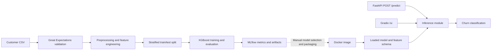

# Telco Customer Churn — ML Engineering & MLOps

A customer churn classification project covering data validation, feature engineering, XGBoost training, experiment tracking, and model serving through a REST API and browser interface.

Built with **Python 3.11 · XGBoost · scikit-learn · Great Expectations · MLflow · FastAPI · Gradio · Docker · GitHub Actions**.

The project demonstrates how a tabular ML experiment can be organized into a repeatable training workflow and a deployable service. It is a portfolio implementation with documented serving limitations and a roadmap toward production readiness.

## Business problem

Customer churn prediction can help a telecom provider prioritize retention outreach. This project uses customer demographics, subscribed services, contract details, and billing information to classify whether a customer is likely to churn.

The evaluation emphasizes recall alongside precision: identifying more churners also means contacting more customers who would have stayed. The pipeline exposes a classification threshold so this trade-off can be explored. Retention effectiveness and financial impact have not been measured.

## Engineering highlights

- **Data quality gate:** Great Expectations checks required columns, categorical values, numeric ranges, missing values, and charge consistency before training proceeds.
- **Tracked experiments:** MLflow records evaluation metrics, timing, selected run parameters, the trained model, feature names, and preprocessing metadata.
- **Imbalanced classification:** XGBoost uses a positive-class weight calculated from the training split, with a configurable evaluation threshold.
- **Two serving interfaces:** FastAPI accepts structured customer requests; Gradio provides a form for interactive demonstrations.
- **Container packaging:** The Dockerfile packages a specific saved model with the application and its dependencies.
- **Regression coverage:** Tests cover validation failures and web-stack compatibility, including FastAPI routes, request validation, and the mounted Gradio interface.

## Architecture



Training and serving are separate entry points. The Gradio callback and FastAPI endpoint both call `predict()` in [src/serving/inference.py](src/serving/inference.py). See [Current limitations](#current-limitations) for the remaining differences between training and serving.

## Dataset

The project uses the [IBM Telco Customer Churn CSV](https://github.com/IBM/telco-customer-churn-on-icp4d/blob/master/data/Telco-Customer-Churn.csv).

| Property | Value |
| --- | --- |
| Customers | 7,043 |
| Raw columns | 21, including the identifier and target |
| Target | `Churn`: `Yes` / `No` |
| Churn distribution | 1,869 churners; 5,174 non-churners |
| Expected local path | `data/raw/Telco-Customer-Churn.csv` |

Preprocessing removes the customer identifier, converts `TotalCharges` to numeric values, fills numeric missing values with zero, and maps the target to binary labels. Feature engineering maps binary categories and one-hot encodes multi-category features.

Raw data, processed data, local MLflow runs, and generated artifacts are excluded from Git. Selected historical serving artifacts are included under `src/serving/model/`.

## Recorded baseline

The following values come from the **bundled historical run**, `3b1a41221fc44548aed629fa42b762e0`, rather than a newly executed benchmark. Its [metrics](src/serving/model/3b1a41221fc44548aed629fa42b762e0/metrics) and [parameters](src/serving/model/3b1a41221fc44548aed629fa42b762e0/params) are included in the repository.

| Metric | Recorded value |
| --- | ---: |
| ROC AUC | 0.837 |
| Recall | 0.821 |
| Precision | 0.490 |
| F1 score | 0.614 |
| Classification threshold | 0.35 |
| Test fraction | 20% |

At this operating point, the recorded evaluation identifies approximately 82% of churners, while approximately 49% of positive predictions correspond to actual churners. These are offline dataset results, not evidence of production performance or retention uplift.

The current training script uses a stratified 80/20 split with `random_state=42`. Its configured XGBoost parameters include 301 estimators, a learning rate of 0.034, and a maximum tree depth of 7. The reported threshold is applied during offline evaluation; serving currently uses the model's class prediction instead.

## Run locally

Run all commands from the repository root. Use Python 3.11, matching the project's dependency baseline and Docker image.

### 1. Install dependencies

```bash
git clone https://github.com/anastzel/Telco-Customer-Churn-ML.git
cd Telco-Customer-Churn-ML

python3.11 -m venv .venv
source .venv/bin/activate
python -m pip install -r requirements.txt
python -m pip check
```

If you already use the project's Conda environment, activate it with `conda activate telco` and run the two pip commands instead of creating a virtual environment.

The requirements pin a compatible Gradio/client/FastAPI stack and retain a setuptools version that provides `pkg_resources` for MLflow 2.14.1. A deprecation warning from that MLflow import can still appear.

### 2. Obtain the data

Download the CSV from the IBM source linked above, or run:

```bash
mkdir -p data/raw
curl -fL \
  https://raw.githubusercontent.com/IBM/telco-customer-churn-on-icp4d/master/data/Telco-Customer-Churn.csv \
  -o data/raw/Telco-Customer-Churn.csv
```

### 3. Train and evaluate

```bash
python scripts/run_pipeline.py \
  --input data/raw/Telco-Customer-Churn.csv \
  --target Churn \
  --threshold 0.35 \
  --test_size 0.2 \
  --experiment "Telco Churn"
```

The pipeline validates the input, prepares features, trains XGBoost, evaluates predictions, and logs the run. Failed validation stops training and logs the failed expectations.

| Output | Location or MLflow artifact |
| --- | --- |
| Processed data | `data/processed/telco_churn_processed.csv` |
| Local feature names | `artifacts/feature_columns.json` |
| Local preprocessing metadata | `artifacts/preprocessing.pkl` |
| Experiment tracking | `mlruns/` by default; configurable with `--mlflow_uri` |
| Run artifacts | `model/`, `feature_columns.txt`, `preprocessing.pkl` |
| Run metrics | Precision, recall, F1, ROC AUC, training time, prediction time, validation status |

`preprocessing.pkl` contains feature names and the target name; it is not a fitted preprocessing pipeline.

Explore runs in the MLflow UI:

```bash
mlflow ui --backend-store-uri ./mlruns --port 5000
```

Open [localhost:5000](http://localhost:5000).

### 4. Start the API and web interface

The local inference loader selects the model directory with the most recent modification time under `mlruns/*/*/artifacts/model`. It expects `feature_columns.txt` inside that directory, while training logs the file one level above it.

After a successful local training run using the default tracking directory, prepare the matching feature file:

```bash
python - <<'PY'
from pathlib import Path
import shutil

models = list(Path("mlruns").glob("*/*/artifacts/model"))
if not models:
    raise SystemExit("No local model found. Run the training pipeline first.")
model_dir = max(models, key=lambda path: path.stat().st_mtime)
shutil.copy2(model_dir.parent / "feature_columns.txt", model_dir / "feature_columns.txt")
print(f"Prepared local serving model: {model_dir}")
PY

python -m uvicorn src.app.main:app --host 127.0.0.1 --port 8000
```

The loader first tries `/app/model`, which is the container path, before falling back to local runs. A message about that first path being unavailable is expected during local development if the fallback succeeds.

| Interface | URL | Purpose |
| --- | --- | --- |
| Health check | [localhost:8000/](http://localhost:8000/) | Confirms the app responds |
| API documentation | [localhost:8000/docs](http://localhost:8000/docs) | Interactive request testing |
| Gradio interface | [localhost:8000/ui](http://localhost:8000/ui) | Customer input form |
| Prediction endpoint | `POST /predict` | JSON request and classification response |

### Example API request

With the server running, execute this in a second terminal:

```bash
curl -X POST http://127.0.0.1:8000/predict \
  -H 'Content-Type: application/json' \
  -d '{
    "gender": "Female",
    "Partner": "No",
    "Dependents": "No",
    "PhoneService": "Yes",
    "MultipleLines": "No",
    "InternetService": "Fiber optic",
    "OnlineSecurity": "No",
    "OnlineBackup": "No",
    "DeviceProtection": "No",
    "TechSupport": "No",
    "StreamingTV": "Yes",
    "StreamingMovies": "Yes",
    "Contract": "Month-to-month",
    "PaperlessBilling": "Yes",
    "PaymentMethod": "Electronic check",
    "tenure": 1,
    "MonthlyCharges": 85.0,
    "TotalCharges": 85.0
  }'
```

A successful response contains a `prediction` field with either `"Likely to churn"` or `"Not likely to churn"`. The API currently returns a class label, not a probability.

## Tests

After downloading the dataset and installing dependencies:

```bash
python -m pytest tests/ -q
```

- [Data validation tests](tests/test_validate_data.py) cover the raw CSV, missing required columns, invalid values, charge consistency, and preservation of the input DataFrame.
- [Web-stack tests](tests/test_app_dependencies.py) cover API routes, Gradio pages and schema, request validation, and the form callback. They replace inference with a stub, so they do not validate model loading or prediction accuracy.

The `scripts/test_*.py` files are additional manual checks; some require local paths or an already running service.

## Docker and image publishing

With Docker installed and running:

```bash
docker build -f dockerfile -t telco-churn:local .
docker run --rm -p 8000:8000 telco-churn:local
```

The [Dockerfile](dockerfile) packages the bundled run `3b1a41221fc44548aed629fa42b762e0` and copies its model and feature schema into `/app/model`. It does not automatically package your latest local training run. To serve a different run in the image, select and package that run's model and matching metadata together.

The [GitHub Actions workflow](.github/workflows/ci.yml), when enabled, runs on pushes to `main`, builds the image, and publishes it to Docker Hub. Its current destination is `anasriad8/telco-fastapi:latest`, inherited from the original project. Publishing under another account requires changing that destination and configuring `DOCKERHUB_USERNAME` and `DOCKERHUB_TOKEN` in repository Actions secrets.

The workflow currently has no test stage, container startup check, or automated AWS deployment. An ECS/Fargate deployment behind an Application Load Balancer is a possible extension; infrastructure provisioning and deployment automation are not included here.

## Current limitations

The following are priorities before using predictions to support real customer decisions:

| Area | Current behavior | Next improvement |
| --- | --- | --- |
| Feature consistency | Serving applies `get_dummies(drop_first=True)` to one customer at a time, which drops the sole observed category and can zero out categorical indicators. | Save and reuse a fitted encoder as part of the model pipeline. |
| Input schema | The API accepts 18 fields and omits the training feature `SeniorCitizen`; feature alignment fills the absent column with zero. | Align the request schema with the training feature contract. |
| Decision threshold | Offline evaluation uses a configurable threshold; serving calls `model.predict()`. | Persist and apply the same threshold at inference. |
| Evaluation | Feature encoding is constructed before the holdout split. | Fit transformations on training data only and evaluate the complete fitted pipeline. |
| API validation and errors | String fields do not enforce allowed categories; caught inference errors return JSON with the default HTTP 200 status. | Add category/range constraints and appropriate error status codes. |
| Model lifecycle | Local model selection uses directory modification time; Docker pins a historical run. | Introduce explicit model version configuration and a tested promotion process. |
| Delivery | CI publishes `latest` without running tests or checking container startup. | Add quality gates and commit-specific image tags before deployment automation. |

## Repository structure

```text
.github/workflows/ci.yml      Docker build and publish workflow
notebooks/EDA.ipynb           Exploratory analysis
scripts/run_pipeline.py      Main training and evaluation entry point
src/
  data/                      CSV loading and preprocessing
  features/                  Feature engineering
  models/                    Training, evaluation, and tuning helpers
  utils/validate_data.py     Great Expectations validation
  serving/inference.py       Model loading, transformation, and prediction
  serving/model/             Bundled historical models and run metadata
  app/main.py                FastAPI application and mounted Gradio UI
tests/                       Validation and web-stack regression tests
requirements.txt             Dependency pins for the Python 3.11 baseline
dockerfile                   Container build definition
```

## Project provenance

This repository extends [anesriad/Telco-Customer-Churn-ML](https://github.com/anesriad/Telco-Customer-Churn-ML) and preserves its Git history and contributor attribution. The bundled model and baseline metrics are inherited artifacts.

Recent work in this version includes migrating validation to the Great Expectations 1.x API, handling raw charge values during validation, correcting dependency compatibility, adding validation and web-stack regression tests, and documenting reproducible setup steps and remaining engineering gaps. Commit history records the individual changes.
