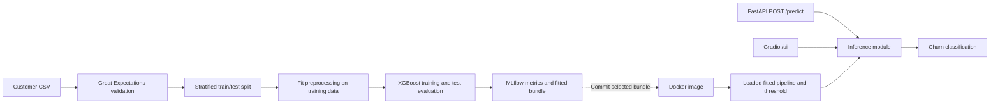

# Telco Customer Churn — ML Engineering & MLOps

A customer churn classification project covering data validation, feature engineering, XGBoost training, experiment tracking, and model serving through a REST API and browser interface.

Built with **Python 3.11 · XGBoost · scikit-learn · Great Expectations · MLflow · FastAPI · Gradio · Docker · GitHub Actions**.

The project demonstrates how a tabular ML experiment can be organized into a repeatable training workflow and a deployable service. It is a portfolio implementation with documented serving limitations and a roadmap toward production readiness.

## Business problem

Customer churn prediction can help a telecom provider prioritize retention outreach. This project uses customer demographics, subscribed services, contract details, and billing information to classify whether a customer is likely to churn.

The evaluation emphasizes recall alongside precision: identifying more churners also means contacting more customers who would have stayed. The pipeline exposes a classification threshold so this trade-off can be explored. Retention effectiveness and financial impact have not been measured.

## Engineering highlights

- **Data quality gate:** Great Expectations checks required columns, categorical values, numeric ranges, missing values, and charge consistency before training proceeds.
- **Tracked experiments:** MLflow records evaluation metrics, timing, selected run parameters, the fitted preprocessing and model pipeline, feature names, and bundle metadata.
- **Imbalanced classification:** XGBoost uses a positive-class weight calculated from the training split, with a configurable evaluation threshold.
- **Two serving interfaces:** FastAPI accepts structured customer requests; Gradio provides a form for interactive demonstrations.
- **Container packaging:** The Dockerfile packages a specific saved model with the application and its dependencies.
- **Regression coverage:** Tests cover validation failures and web-stack compatibility, including FastAPI routes, request validation, and the mounted Gradio interface.

## Architecture



Training and serving are separate entry points. The Gradio callback and FastAPI endpoint both call `predict()` in [src/serving/inference.py](src/serving/inference.py). Both paths use the same fitted preprocessing and threshold stored in the bundle.

## Dataset

The project uses the [IBM Telco Customer Churn CSV](https://github.com/IBM/telco-customer-churn-on-icp4d/blob/master/data/Telco-Customer-Churn.csv).

| Property | Value |
| --- | --- |
| Customers | 7,043 |
| Raw columns | 21, including the identifier and target |
| Target | `Churn`: `Yes` / `No` |
| Churn distribution | 1,869 churners; 5,174 non-churners |
| Expected local path | `data/raw/Telco-Customer-Churn.csv` |

Training excludes the customer identifier, maps the target to binary labels, and splits the raw features before fitting. The fitted pipeline converts numeric fields, imputes missing values, and one-hot encodes categorical fields. Inference reuses those fitted transformations.

Raw data, processed data, local MLflow runs, and generated artifacts are excluded from Git. The current fitted serving bundle and selected historical artifacts are included under `src/serving/model/`.

## Current bundled model

The fitted bundle in `src/serving/model/current/churn_bundle.joblib` was trained on the 7,043-row IBM dataset with the corrected pipeline. Its held-out test metrics (1,409 customers, threshold 0.35) are stored in the bundle:

| Metric | Value |
| --- | ---: |
| ROC AUC | 0.832 |
| Recall | 0.807 |
| Precision | 0.491 |
| F1 score | 0.611 |

The training run ID and data hash are stored in the bundle. The run was logged locally by MLflow; ignored `mlruns/` files are not in Git.

## Historical baseline

The following values come from an **inherited historical run**, `3b1a41221fc44548aed629fa42b762e0`, rather than a newly executed benchmark. Its [metrics](src/serving/model/3b1a41221fc44548aed629fa42b762e0/metrics) and [parameters](src/serving/model/3b1a41221fc44548aed629fa42b762e0/params) are included in the repository.

| Metric | Recorded value |
| --- | ---: |
| ROC AUC | 0.837 |
| Recall | 0.821 |
| Precision | 0.490 |
| F1 score | 0.614 |
| Classification threshold | 0.35 |
| Test fraction | 20% |

At this operating point, the recorded evaluation identifies approximately 82% of churners, while approximately 49% of positive predictions correspond to actual churners. These are offline dataset results, not evidence of production performance or retention uplift.

The current training script uses a stratified 80/20 split with `random_state=42`. Its configured XGBoost parameters include 301 estimators, a learning rate of 0.034, and a maximum tree depth of 7. Training and serving now use the same fitted preprocessing pipeline and decision threshold. The historical figures above are retained for comparison with the newly trained bundle.

## Run locally

Run all commands from the repository root. Use Python 3.11, matching the project's dependency baseline and Docker image.

### 1. Install dependencies

```bash
git clone https://github.com/anastzel/Telco-Customer-Churn-ML.git
cd Telco-Customer-Churn-ML

python3.11 -m venv .venv
source .venv/bin/activate
python -m pip install -r requirements.txt
python -m pip check
```

If you already use the project's Conda environment, activate it with `conda activate telco` and run the two pip commands instead of creating a virtual environment.

The requirements pin a compatible Gradio/client/FastAPI stack and retain a setuptools version that provides `pkg_resources` for MLflow 2.14.1. A deprecation warning from that MLflow import can still appear.

### 2. Obtain the data

Download the CSV from the IBM source linked above, or run:

```bash
mkdir -p data/raw
curl -fL \
  https://raw.githubusercontent.com/IBM/telco-customer-churn-on-icp4d/master/data/Telco-Customer-Churn.csv \
  -o data/raw/Telco-Customer-Churn.csv
```

### 3. Train and evaluate

```bash
python scripts/run_pipeline.py \
  --input data/raw/Telco-Customer-Churn.csv \
  --target Churn \
  --output src/serving/model/current/churn_bundle.joblib \
  --threshold 0.35 \
  --test_size 0.2 \
  --experiment "Telco Churn"
```

The pipeline validates the input, makes a stratified train/test split, fits preprocessing on the training data, trains XGBoost, evaluates on the held-out data, and logs the run. Failed validation stops training.

The output bundle contains the fitted pipeline, evaluation threshold, input schema, feature names, run ID, and source-data hash. The default output is `artifacts/churn_bundle.joblib`; the command above updates the committed serving bundle.

Explore runs in the MLflow UI:

```bash
mlflow ui --backend-store-uri ./mlruns --port 5000
```

Open [localhost:5000](http://localhost:5000).

### 4. Start the API and web interface

The application loads `src/serving/model/current/churn_bundle.joblib` by default. Set `MODEL_PATH` to a different trained bundle if needed.

```bash
python -m uvicorn src.app.main:app --host 127.0.0.1 --port 8000
```

Startup fails clearly when the selected bundle is missing or incomplete.

| Interface | URL | Purpose |
| --- | --- | --- |
| Health check | [localhost:8000/](http://localhost:8000/) | Confirms the app responds |
| API documentation | [localhost:8000/docs](http://localhost:8000/docs) | Interactive request testing |
| Gradio interface | [localhost:8000/ui](http://localhost:8000/ui) | Customer input form |
| Prediction endpoint | `POST /predict` | JSON request and classification response |

### Example API request

With the server running, execute this in a second terminal:

```bash
curl -X POST http://127.0.0.1:8000/predict \
  -H 'Content-Type: application/json' \
  -d '{
    "gender": "Female",
    "Partner": "No",
    "Dependents": "No",
    "PhoneService": "Yes",
    "MultipleLines": "No",
    "InternetService": "Fiber optic",
    "OnlineSecurity": "No",
    "OnlineBackup": "No",
    "DeviceProtection": "No",
    "TechSupport": "No",
    "StreamingTV": "Yes",
    "StreamingMovies": "Yes",
    "Contract": "Month-to-month",
    "PaperlessBilling": "Yes",
    "PaymentMethod": "Electronic check",
    "SeniorCitizen": 0,
    "tenure": 1,
    "MonthlyCharges": 85.0,
    "TotalCharges": 85.0
  }'
```

A successful response contains a `prediction` field with either `"Likely to churn"` or `"Not likely to churn"`. The API currently returns a class label, not a probability.

## Tests

After installing dependencies (the tests use synthetic validation data and the committed model bundle):

```bash
python -m pytest tests/ -q
```

- [Data validation tests](tests/test_validate_data.py) cover valid synthetic records, missing required columns, invalid values, charge consistency, and preservation of the input DataFrame.
- [Web-stack tests](tests/test_app_dependencies.py) cover API routes, Gradio pages and schema, request validation, and inference against the fitted pipeline. They load the committed model and check a real API prediction.

The `scripts/test_*.py` files are additional manual checks; the Optuna modeling script uses training-set cross-validation and reports the untouched test metrics once.

## Docker and image publishing

With Docker installed and running:

```bash
docker build -f Dockerfile -t telco-churn:local .
docker run --rm -p 8000:8000 telco-churn:local
```

The [Dockerfile](Dockerfile) installs only serving dependencies and packages the current fitted bundle. Re-run the training command above to update that bundle before building a new image.

The [GitHub Actions workflow](.github/workflows/ci.yml), when enabled, runs on pushes to `main`, builds the image, and publishes it to Docker Hub. Its destination is `anastzel/telco-fastapi:latest`. Publishing requires configuring `DOCKERHUB_USERNAME` and `DOCKERHUB_TOKEN` in repository Actions secrets with credentials that have push access to that Docker Hub repository.

The workflow runs Python and integration tests for pull requests and pushes, checks container startup and a real API prediction, and publishes on `main` only after those checks pass. It tags each image with both `latest` and its commit SHA. It does not automate AWS deployment. An ECS/Fargate deployment behind an Application Load Balancer is a possible extension; infrastructure provisioning and deployment automation are not included here.

## Current limitations

- The bundled model is trained on a public example dataset. Its offline metrics are not evidence of production retention impact.
- The training script has fixed model hyperparameters; the separate Optuna example uses training-set cross-validation but is not a model promotion process.
- Model retraining is manual. CI validates and publishes the committed bundle; it does not fetch data or retrain.
- The endpoint returns a class label. Probability calibration, drift monitoring, and a formal model registry are future work.

## Repository structure

```text
.github/workflows/ci.yml      Docker build and publish workflow
notebooks/EDA.ipynb           Exploratory analysis
scripts/run_pipeline.py      Main training and evaluation entry point
src/
  data/                      CSV loading and preprocessing
  features/                  Legacy feature builder and fitted pipeline
  models/                    Training, evaluation, and tuning helpers
  utils/validate_data.py     Great Expectations validation
  serving/inference.py       Model loading, transformation, and prediction
  serving/model/             Current fitted bundle and historical runs
  app/main.py                FastAPI application and mounted Gradio UI
tests/                       Validation and web-stack regression tests
requirements.txt             Training and test dependency pins
requirements-serving.txt     Smaller container runtime dependencies
Dockerfile                   Container build definition
```

## Project provenance

This repository extends [anesriad/Telco-Customer-Churn-ML](https://github.com/anesriad/Telco-Customer-Churn-ML) and preserves its Git history and contributor attribution. Historical runs and their metrics are inherited artifacts; the current fitted bundle was retrained for this version.

Recent work in this version includes a fitted training and serving pipeline, an explicit model bundle and threshold, stronger API validation, real inference tests, and CI checks before image publication. Commit history records the individual changes.
